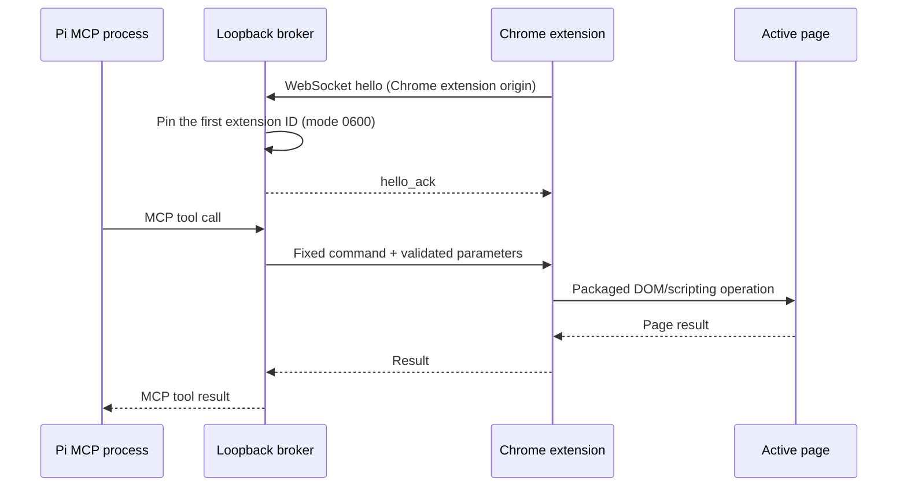

# Architecture

Pi Browser Bridge has two local components. The Pi package registers a stdio MCP server for each Pi session. The Chrome MV3 extension reconnects to a WebSocket listener bound only to `127.0.0.1`.

## Automatic pairing

The extension retries a fixed loopback endpoint; Pi requires no token, port entry, or manual copy/paste. The browser supplies a `chrome-extension://<id>` origin during its WebSocket handshake. The server accepts extension origins only, confirms the ID in the extension hello message matches the browser-provided origin, and pins the first extension ID in `~/.pi/agent/state/pi-browser-bridge/extension.json`. Reconnects from that same ID are accepted. Another extension is rejected until the Pi tool `reset_pairing` is explicitly called.

The server listens on IPv4 loopback only. It does not expose an HTTP endpoint, and it never binds to a LAN interface.

## Browser operations

The MCP server exposes fixed browser operations; there is no tool that evaluates arbitrary JavaScript. The extension uses `chrome.scripting` with packaged functions and passes only validated parameters. Form tools reject password, hidden, file, token-like, CSRF, and one-time-code fields. Field values are not returned in tool results. Pages can still display private information, which may enter the configured model context through `read_page` or screenshots.

The extension requests all-site access because users want to automate different web apps without granting each origin separately. Chrome displays this permission to the user. The extension has no Cookie, debugger, or user-script permission and does not collect telemetry.

## Runtime limits

The current bridge supports one Pi MCP server owning the fixed port per Chrome profile. Pi sessions in other processes can report that the port is busy. Tool calls target the active tab unless a tool explicitly accepts `tab_id`.
