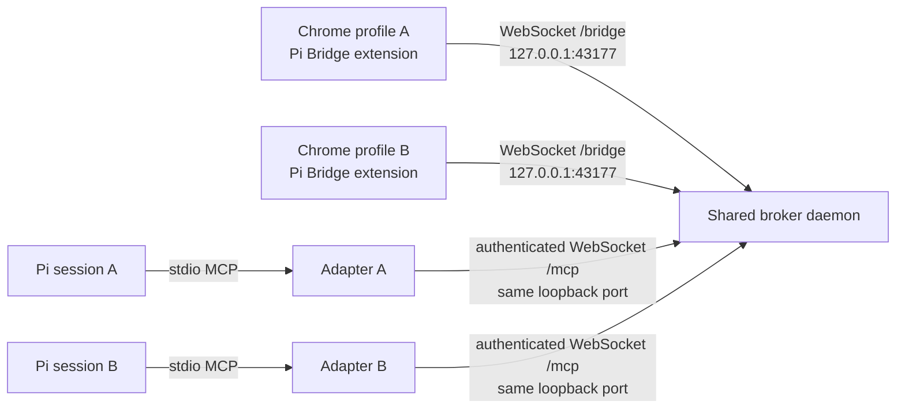

# Architecture

Pi Bridge has one Chrome-facing broker per Pi agent directory (user-level by default) and one stdio MCP adapter per Pi session. The broker owns the sole loopback WebSocket endpoint; adapters attach to it over an authenticated control path on that same port. The default agent directory is `~/.pi/agent`.

The default broker scope follows the Pi agent directory: sessions that share `~/.pi/agent` also share one broker. If you intentionally configure a different `PI_CODING_AGENT_DIR`, it defines a separate broker and requires its own Chrome extension pairing.

The broker starts when the first MCP adapter connects. Later adapters reuse its health-checked endpoint instead of binding another server. The broker remains alive while Pi sessions use it and shuts down after an idle period with no MCP clients. Stopping one Pi session closes only that session's MCP connection; other sessions and Chrome profile sockets remain connected.

## Pairing and profile routing

Each Chrome profile stores a random profile ID and optional user-selected label in extension storage. The browser supplies its `chrome-extension://<id>` origin during the `/bridge` WebSocket handshake. The broker pins the extension ID in `~/.pi/agent/state/pi-browser-bridge/extension.json`, accepts reconnects from that ID, and registers each profile ID to its own socket. A different extension ID is refused until a Pi user explicitly calls `reset_pairing` while intentionally replacing the extension.

Pi MCP adapters authenticate to `/mcp` with a random bearer token stored in a mode-`0600` file under `~/.pi/agent/state/pi-browser-bridge/shared-broker/`. The `/mcp` route accepts loopback connections only, rejects browser `Origin` headers, and exposes a fixed internal method set. The HTTP health route reports only broker identity, protocol, port, and readiness. Neither route exposes arbitrary CDP or page evaluation.

The broker routes each browser command to the socket named by `profile_id`; the response must arrive over the same socket that received the command. If only one profile is connected, tools can use it implicitly. If multiple profiles are connected, calls without an explicit ID fail rather than selecting one silently. Profile names are labels, not routing authority.

## Shared access and concurrency

Pi sessions may read the same authorized profile concurrently. Browser mutations are serialized within a profile so two MCP sessions cannot interleave page changes. Independent profiles can be written concurrently. Chrome download-manager operations are serialized per profile; the user's explicitly requested `download_url` can overlap unrelated tab operations and a confirmed upload setup because it does not mutate the target page.

Every MCP adapter keeps its own request/response stream and upload-confirmation hook. A result returns to the Pi session that initiated the request. `upload_file` still requires action-time approval showing the canonical path, size, destination origin, profile, and tab. The broker does not transfer that approval between sessions.

## Browser operations

The MCP server exposes fixed browser operations; there is no tool that evaluates arbitrary JavaScript or forwards arbitrary CDP commands. Ordinary reads and actions use packaged `chrome.scripting` functions. For accessibility, the extension briefly attaches Chrome's debugger API to request `Accessibility.getFullAXTree`, returns a paginated tree of node IDs, roles, names, hierarchy, and safe states, and omits control values. `get_visible_dom` filters the same snapshot to interactive nodes; `get_by_role`, `fill_by_role`, and `click_by_role` provide Playwright-style role/name matching. Node clicks revalidate the snapshot and use fixed DOM geometry plus `Input.dispatchMouseEvent`; ordinary accessible text entry revalidates the same node and uses `Input.insertText`. The debugger detaches after each operation. Pi Bridge does not bundle the Playwright runtime or expose arbitrary CDP to the model. Text form tools still refuse password, hidden, file, token-like, CSRF, and one-time-code values. Pages can display private information that may enter model context through page text, accessibility names, or screenshots.

`download_url` uses Chrome's Downloads API for an explicitly requested HTTP/HTTPS URL. Chrome may send cookies for that URL's host. `list_page_assets` inventories visible images/media with selectors; `download_media` saves HTTP(S) and page-created `blob:`/`data:` assets through Chrome's download manager, or observes a page-triggered download, then returns the local path and metadata. The extension does not enumerate download history or open downloaded files.

The browser tools can inspect and control an explicitly selected background tab without activating it. `create_workspace` makes a named Pi Bridge tab group in the current window, and only group IDs whose titles use the reserved `Pi Bridge: ` prefix can receive new tabs through the workspace tool. It never rehomes existing tabs. `read_urls` uses temporary background tabs and removes them after each read. Screenshots are limited to the selected visible tab; background screenshot requests fail without changing focus.

The extension requests all-site access because users want to automate different web apps without granting each origin separately. Chrome displays this permission to the user. The `tabGroups` permission is used for named workspaces, `storage` saves profile IDs and labels, `downloads` monitors requested downloads, and `debugger` is used only for packaged accessibility-tree reads, validated pointer clicks, ordinary accessible text entry, and confirmed file uploads. The extension has no Cookie permission or user-script permission and exposes no arbitrary CDP tool.

## Runtime limits

The default shared broker uses `127.0.0.1:43177` for both Chrome `/bridge` and Pi MCP adapter `/mcp` connections. Multiple Pi sessions in the same agent directory share this broker; they do not each claim the browser port. `PI_BROWSER_BRIDGE_PORT` selects the broker port when it is first started, and the shared runtime state records that port for later sessions. The adapter checks the health response before attaching. If an older broker or unrelated process owns the port, it fails with a migration error and does not terminate that process.

A profile can contain multiple windows and tabs. Tools that accept `tab_id` can target any tab; if omitted, they target the selected tab in that profile's last-focused window. `list_tabs` and `list_workspaces` report that window. Chrome-internal pages and the Chrome Web Store remain inaccessible to extension scripting.
